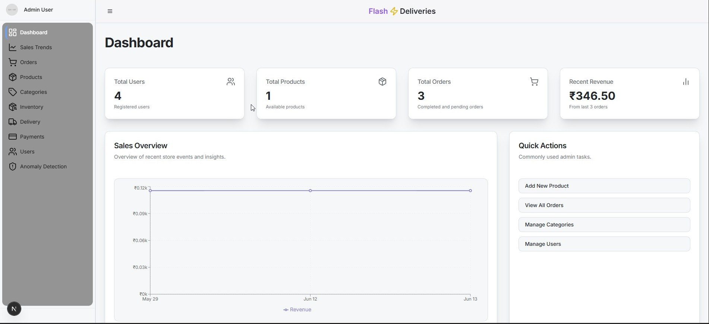

# ⚡ Flash Deliveries — Admin Dashboard

The **Admin Web App** is a powerful dashboard for managing **grocery and restaurant operations**, including products, orders, users, and delivery workflows.

Built with **Next.js**, this dashboard acts as the control center for the Flash Deliveries platform.

🔗 Related Repositories:
- Backend API: https://github.com/asad2050/flash-deliveries-api
- Customer Web App: https://github.com/asad2050/flash-deliveries-web
- Customer Mobile App: https://github.com/asad2050/flash-deliveries-mobile

---
## Demo Video

Coming soon...

---

## 🧠 Core Capabilities

### 📊 Dashboard & Analytics
- Order and revenue metrics
- Sales trends (planned)
- Platform health overview

### 📦 Orders & Payments
- Search and filter orders
- Update order & payment status
- Assign delivery drivers
- Mock refund workflows

### 🛒 Products & Inventory
- Product CRUD with images
- Category management
- Inventory stock tracking with audit logs

### 👥 Users & Delivery
- Role-based user management
- Driver availability tracking
- Manual password reset actions

### 🍽️ Restaurant Operations
- Menu categories and items
- Variant & add-on management
- Dietary flags (veg / non-veg)
- Restaurant-specific orders

### 🤖 AI Tools (Experimental)
- GenAI-powered anomaly detection

---

## 🛠️ Tech Stack

- Next.js (App Router)
- TypeScript
- Tailwind CSS
- Radix UI
- Axios
- JWT authentication

---

## 📄 Notes

- Designed for internal operations

- Focused on scalability and clarity

- Built to support both grocery & restaurant workflows

---

